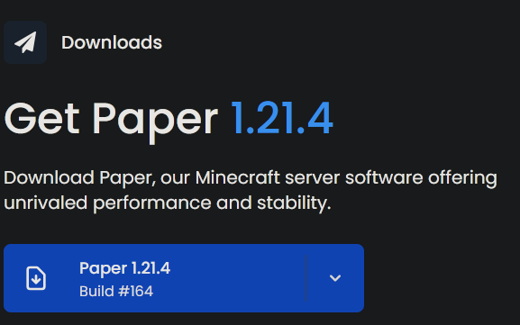
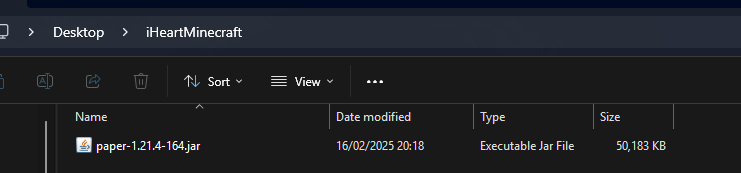
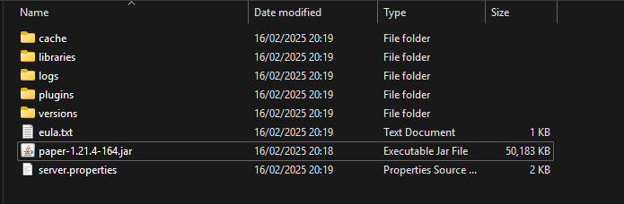
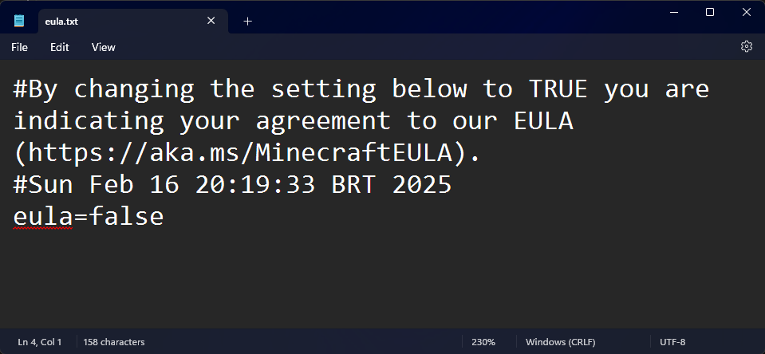
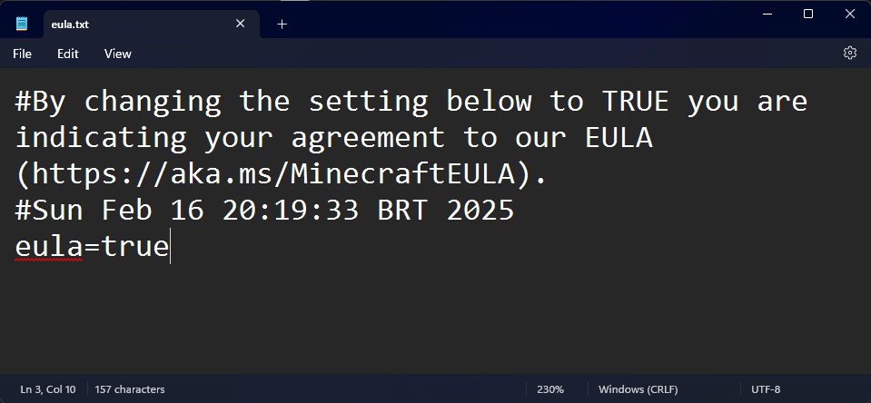
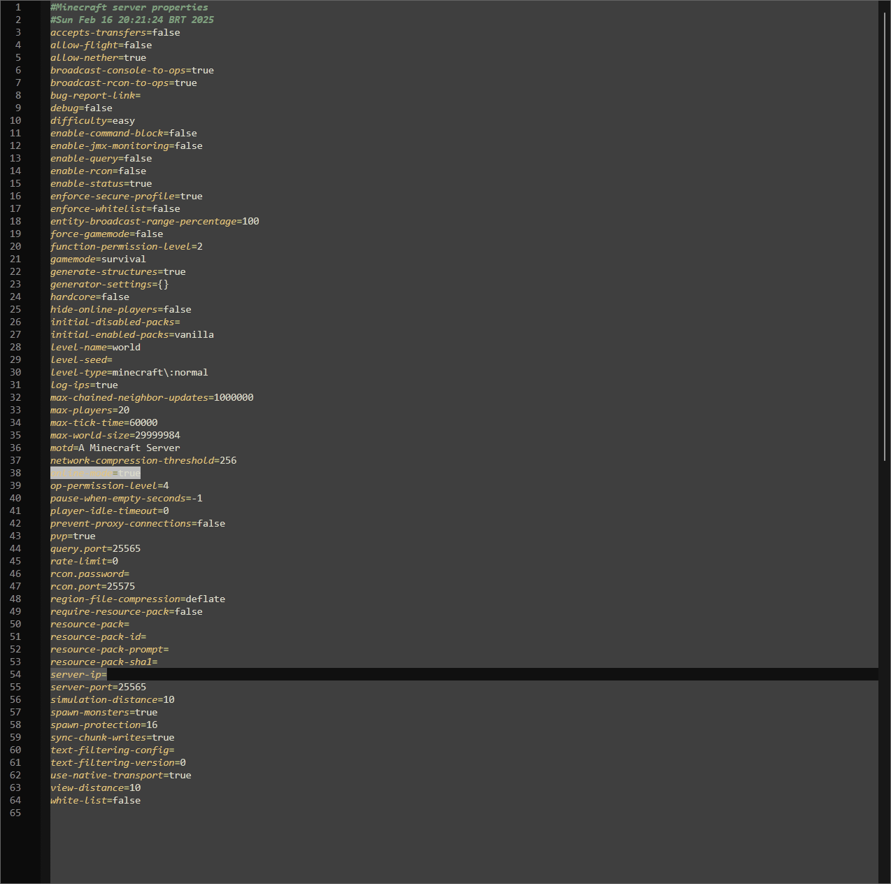

# minecraft-server-tutorial
1. Baixe a última versão do PaperMC em https://papermc.io/downloads/paper


2. Coloque o arquivo do Paper numa pasta nova e vazia onde seu servidor rodará.


3. Execute o arquivo. Ele irá criar vários arquivos na pasta e nenhuma janela abrirá.


4. Abra o eula.txt. Troque o ``eula=false`` para ``eula=true``. Salve e execute o arquivo do paper de novo.




5. Esta janela abrirá. Este é o terminal do server. Assim que ler ``Done (<número>)``, isso significa que o mapa acabou de renderizar. Você pode fechar o terminal com o comando ``stop``


6. Abra o arquivo ``server.properties`` e edite as linhas 
- ``online-mode=true`` para ``online-mode=false``
- ``server-ip=`` para ``server-ip=<IP LOCAL DA MÁQUINA HOST! SEU COMPUTADOR WINDOWS NO CASO>``

Outras linhas que você pode mudar
- ``difficulty=easy`` para ``difficulty=hard``
- ``allow-flight=false`` para ````


7. Você pode salvar e fechar o arquivo.